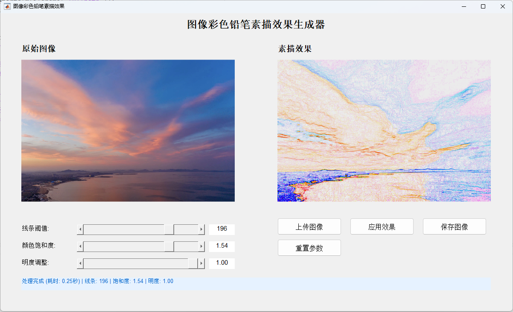

# Image Color Pencil Sketch Effect / 图像彩色铅笔素描效果

[English](#english) | [中文](#chinese)

<a name="english"></a>

## 🇬🇧 English

### Overview
This MATLAB project implements a color pencil sketch effect for images using a vector gradient-based algorithm. It provides both a graphical user interface (GUI) for interactive editing and batch processing capabilities.


### Features
- **Advanced Algorithm**: Vector gradient method with Sobel operators for high-quality line extraction
- **Interactive GUI**: Real-time parameter adjustment with instant preview
- **Batch Processing**: Process multiple images at once with consistent settings
- **Three Adjustable Parameters**:
  - **Line Threshold** (0-255): Controls line intensity and thickness
  - **Saturation** (0.0-2.0): Adjusts color vibrancy
  - **Brightness** (0-1): Controls overall brightness in HSV space
- **Multiple Format Support**: JPEG, PNG, BMP

### System Requirements
- MATLAB R2018b or later
- Image Processing Toolbox

### Project Structure
```
image-pencil-sketch/
├── src/
│   ├── core/              # Core algorithms
│   │   ├── applyPencilSketch.m      # Main processing function
│   │   ├── adjustBrightness.m       # HSV brightness adjustment
│   │   ├── adjustSaturation.m       # HSV saturation adjustment
│   │   └── extractLines.m           # Vector gradient line extraction
│   ├── gui/               # User interface
│   │   └── PencilSketchGUI.m        # Graphical interface
│   └── utils/             # Utility functions
│       ├── loadImage.m              # Image loading
│       └── saveImage.m              # Image saving
├── examples/
│   ├── input/             # Sample input images
│   └── output/            # Processed output images
├── main.m                 # Main GUI launcher
├── batch_process.m        # Batch processing script
└── README.md              # This file
```

### Installation & Usage

#### Method 1: GUI Mode (Recommended)
1. Open MATLAB
2. Navigate to the project folder
3. Run the main script:
   ```matlab
   cd src
   main
   ```
4. Use the GUI to:
   - Click "上传图像" (Upload Image) to load an image
   - Adjust the three sliders to control the effect
   - Click "应用效果" (Apply Effect) to see the result
   - Click "保存图像" (Save Image) to export the result
   - Click "重置参数" (Reset Parameters) to restore default values

#### Method 2: Batch Processing
1. Place images in `examples/input/` folder
2. Edit `batch_process.m` to adjust parameters:
   ```matlab
   lineThreshold = 200;        % Line threshold (0-255)
   saturationValue = 1.0;      % Saturation (0.0-2.0)
   brightnessValue = 0.5;      % Brightness (0-1)
   ```
3. Run the batch script:
   ```matlab
   cd src
   batch_process
   ```
4. Find results in `examples/output/` folder

#### Method 3: Programmatic Usage
```matlab
% Add paths
addpath(genpath('src'));

% Load image
img = loadImage('path/to/image.jpg');

% Apply pencil sketch effect
sketch = applyPencilSketch(img, 200, 1.0, 0.5);

% Save result
saveImage(sketch, 'output.jpg');
```

### Parameter Guide

| Parameter | Range | Default | Description |
|-----------|-------|---------|-------------|
| Line Threshold | 0-255 | 200 | Higher = fewer lines<br>Lower = more lines |
| Saturation | 0.0-2.0 | 1.0 | 0 = grayscale<br>1.0 = original colors<br>>1.0 = enhanced colors |
| Brightness | 0-1 | 0.5 | 0 = darkest<br>0.5 = original<br>1.0 = brightest |

### Algorithm Details

The project uses a **Vector Gradient Method** with the following steps:

1. **Brightness Adjustment**: Modifies the V channel in HSV color space
2. **Saturation Adjustment**: Modifies the S channel in HSV color space
3. **Line Extraction**:
   - Applies Sobel operators to each RGB channel independently
   - Computes per-channel gradients
   - Inverts colors for white background with dark lines
   - Applies adaptive thresholding
   - Maps line intensity to [0, 235] range for realistic pencil effect

### Troubleshooting

**Issue**: `PencilSketchGUI not found`
- **Solution**: The `main.m` script automatically adds required paths. Make sure to run it from within the project folder.

**Issue**: Out of memory for large images
- **Solution**: Resize images before processing or increase MATLAB's memory allocation.

**Issue**: GUI doesn't display properly
- **Solution**: Update MATLAB to R2018b or later.

### License
This project is created for educational purposes.

### Author
Created as a coursework project for Digital Image Processing.

### Version
Version 1.3 - Updated with HSV brightness control

---

<<<<<<< HEAD
=======
<a name="chinese"></a>

>>>>>>> af316de9c30612c31a5eb064223cfcd502215185
## 🇨🇳 中文

### 概述
这是一个基于向量梯度算法的MATLAB彩色铅笔素描效果项目。提供交互式图形界面和批量处理功能。


### 功能特性
- **先进算法**：基于Sobel算子的向量梯度方法，实现高质量线条提取
- **交互式GUI**：实时参数调整，即时预览效果
- **批量处理**：一次性处理多张图像，保持一致的参数设置
- **三个可调参数**：
  - **线条阈值** (0-255)：控制线条强度和粗细
  - **饱和度** (0.0-2.0)：调整颜色鲜艳度
  - **明度** (0-1)：在HSV色彩空间中控制整体亮度
- **多格式支持**：JPEG、PNG、BMP

### 系统要求
- MATLAB R2018b 或更高版本
- 图像处理工具箱（Image Processing Toolbox）

### 项目结构
```
image-pencil-sketch/
├── src/
│   ├── core/              # 核心算法
│   │   ├── applyPencilSketch.m      # 主处理函数
│   │   ├── adjustBrightness.m       # HSV明度调整
│   │   ├── adjustSaturation.m       # HSV饱和度调整
│   │   └── extractLines.m           # 向量梯度线条提取
│   ├── gui/               # 用户界面
│   │   └── PencilSketchGUI.m        # 图形界面
│   └── utils/             # 工具函数
│       ├── loadImage.m              # 图像加载
│       └── saveImage.m              # 图像保存
├── examples/
│   ├── input/             # 示例输入图像
│   └── output/            # 处理后的输出图像
├── main.m                 # 主GUI启动器
├── batch_process.m        # 批处理脚本
└── README.md              # 本文件
```

### 安装与使用

#### 方法1：GUI模式（推荐）
1. 打开MATLAB
2. 导航到项目文件夹
3. 运行主脚本：
   ```matlab
   cd src
   main
   ```
4. 使用GUI界面：
   - 点击"上传图像"加载图片
   - 调整三个滑块控制效果
   - 点击"应用效果"查看结果
   - 点击"保存图像"导出结果
   - 点击"重置参数"恢复默认值

#### 方法2：批量处理
1. 将图像放入 `examples/input/` 文件夹
2. 编辑 `batch_process.m` 调整参数：
   ```matlab
   lineThreshold = 200;        % 线条阈值 (0-255)
   saturationValue = 1.0;      % 饱和度 (0.0-2.0)
   brightnessValue = 0.5;      % 明度 (0-1)
   ```
3. 运行批处理脚本：
   ```matlab
   cd src
   batch_process
   ```
4. 在 `examples/output/` 文件夹中查看结果

#### 方法3：编程方式调用
```matlab
% 添加路径
addpath(genpath('src'));

% 加载图像
img = loadImage('path/to/image.jpg');

% 应用铅笔素描效果
sketch = applyPencilSketch(img, 200, 1.0, 0.5);

% 保存结果
saveImage(sketch, 'output.jpg');
```

### 参数指南

| 参数 | 范围 | 默认值 | 说明 |
|------|------|--------|------|
| 线条阈值 | 0-255 | 200 | 值越大 = 线条越多<br>值越小 = 线条越少 |
| 饱和度 | 0.0-2.0 | 1.0 | 0 = 灰度图<br>1.0 = 原始颜色<br>>1.0 = 增强颜色 |
| 明度 | 0-1 | 0.5 | 0 = 最暗<br>0.5 = 原始<br>1.0 = 最亮 |

### 算法详情

本项目使用**向量梯度方法**，包含以下步骤：

1. **明度调整**：在HSV色彩空间中修改V通道
2. **饱和度调整**：在HSV色彩空间中修改S通道
3. **线条提取**：
   - 对每个RGB通道独立应用Sobel算子
   - 计算每通道梯度
   - 反转颜色以获得白底黑线效果
   - 应用自适应阈值处理
   - 将线条强度映射到[0, 235]范围，模拟真实铅笔效果

### 常见问题

**问题**：找不到 `PencilSketchGUI`
- **解决方案**：`main.m` 脚本会自动添加所需路径。确保从项目文件夹内运行。

**问题**：处理大图像时内存不足
- **解决方案**：在处理前调整图像大小，或增加MATLAB的内存分配。

**问题**：GUI显示不正常
- **解决方案**：将MATLAB更新到R2018b或更高版本。

### 许可证
本项目为教育用途创建。

### 作者
作为数字图像处理课程作业项目创建。

### 版本
版本 1.3 - 更新为HSV明度控制
